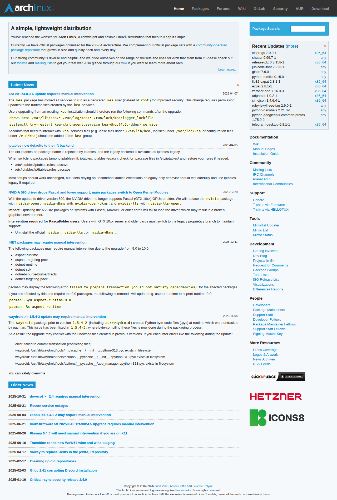

# Visited: https://archlinux.org
**Time:** Mon May 11 07:45:03 UTC 2026

## Screenshot

## Raw HTML
[page.html](./page.html)

## Downloaded Media (0 files)
_No media files downloaded_

## Other Links
- [/](/)
- [/about/](/about/)
- [/art/](/art/)
- [/donate/](/donate/)
- [/download/](/download/)
- [/feeds/](/feeds/)
- [/feeds/news/](/feeds/news/)
- [/feeds/packages/](/feeds/packages/)
- [/groups/](/groups/)
- [/master-keys/](/master-keys/)
- [/mirrorlist/](/mirrorlist/)
- [/mirrors/](/mirrors/)
- [/mirrors/status/](/mirrors/status/)
- [/news/](/news/)
- [/news/cleaning-up-old-repositories/](/news/cleaning-up-old-repositories/)
- [/news/critical-rsync-security-release-340/](/news/critical-rsync-security-release-340/)
- [/news/dovecot-24-requires-manual-intervention/](/news/dovecot-24-requires-manual-intervention/)
- [/news/glibc-241-corrupting-discord-installation/](/news/glibc-241-corrupting-discord-installation/)
- [/news/iptables-now-defaults-to-the-nft-backend/](/news/iptables-now-defaults-to-the-nft-backend/)
- [/news/kea-1303-6-update-requires-manual-intervention/](/news/kea-1303-6-update-requires-manual-intervention/)
- [/news/linux-firmware-2025061312fe085f-5-upgrade-requires-manual-intervention/](/news/linux-firmware-2025061312fe085f-5-upgrade-requires-manual-intervention/)
- [/news/net-packages-may-require-manual-intervention/](/news/net-packages-may-require-manual-intervention/)
- [/news/nvidia-590-driver-drops-pascal-support-main-packages-switch-to-open-kernel-modules/](/news/nvidia-590-driver-drops-pascal-support-main-packages-switch-to-open-kernel-modules/)
- [/news/plasma-640-will-need-manual-intervention-if-you-are-on-x11/](/news/plasma-640-will-need-manual-intervention-if-you-are-on-x11/)
- [/news/recent-services-outages/](/news/recent-services-outages/)
- [/news/transition-to-the-new-wow64-wine-and-wine-staging/](/news/transition-to-the-new-wow64-wine-and-wine-staging/)
- [/news/valkey-to-replace-redis-in-the-extra-repository/](/news/valkey-to-replace-redis-in-the-extra-repository/)
- [/news/waydroid-154-3-update-may-require-manual-intervention/](/news/waydroid-154-3-update-may-require-manual-intervention/)
- [/news/zabbix-741-2-may-requires-manual-intervention/](/news/zabbix-741-2-may-requires-manual-intervention/)
- [/opensearch/packages/](/opensearch/packages/)
- [/packages/](/packages/)
- [/packages/?sort=-last_update](/packages/?sort=-last_update)
- [/packages/core/x86_64/expat/](/packages/core/x86_64/expat/)
- [/packages/core/x86_64/xfsprogs/](/packages/core/x86_64/xfsprogs/)
- [/packages/differences/](/packages/differences/)
- [/packages/extra/any/glaze/](/packages/extra/any/glaze/)
- [/packages/extra/any/junicode-font/](/packages/extra/any/junicode-font/)
- [/packages/extra/any/python-googleapis-common-protos/](/packages/extra/any/python-googleapis-common-protos/)
- [/packages/extra/any/python-narwhals/](/packages/extra/any/python-narwhals/)
- [/packages/extra/any/python-tomlkit/](/packages/extra/any/python-tomlkit/)
- [/packages/extra/any/ruby-jekyll-seo-tag/](/packages/extra/any/ruby-jekyll-seo-tag/)
- [/packages/extra/any/shutter/](/packages/extra/any/shutter/)
- [/packages/extra/x86_64/release-plz/](/packages/extra/x86_64/release-plz/)
- [/packages/extra/x86_64/simdjson/](/packages/extra/x86_64/simdjson/)
- [/packages/extra/x86_64/telegram-desktop/](/packages/extra/x86_64/telegram-desktop/)
- [/packages/extra/x86_64/uriparser/](/packages/extra/x86_64/uriparser/)
- [/packages/extra/x86_64/zerotier-one/](/packages/extra/x86_64/zerotier-one/)
- [/packages/multilib/x86_64/lib32-expat/](/packages/multilib/x86_64/lib32-expat/)
- [/people/developer-fellows/](/people/developer-fellows/)
- [/people/developers/](/people/developers/)

## Stats
- Links: 95
- Media: 0
